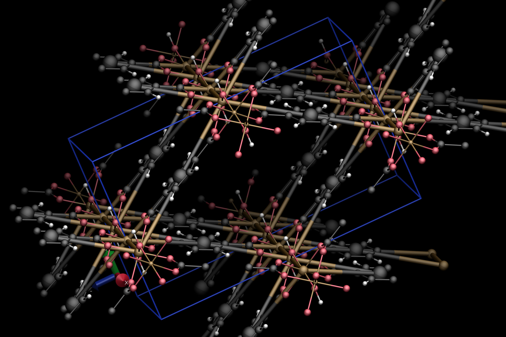
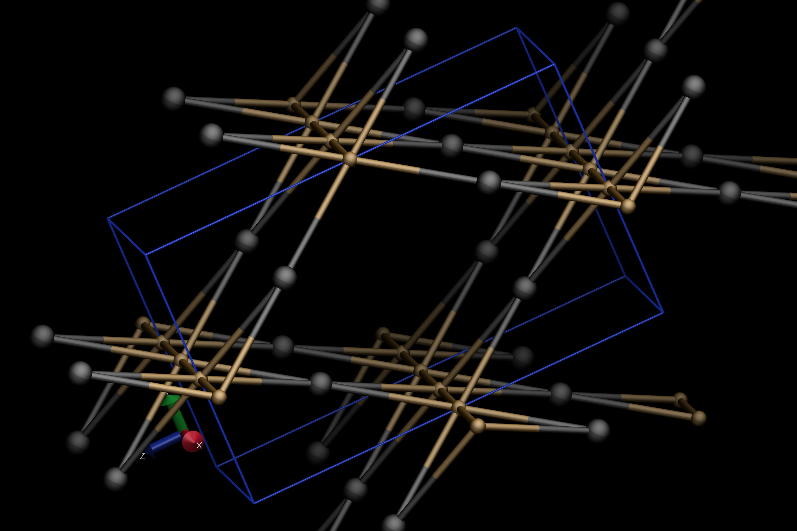

# Visualization

When processing individual files through CrystalNets.jl, it is often useful to check
whether the detected net actually corresponds to the expected one. To allow this, both
the parsed input file as well as the detected subnets are automatically exported by default
as VTF files. This file format is recognized by the molecular visualization program
[VMD](https://www.ks.uiuc.edu/Research/vmd/) and has the property of including explicit
bonds, which is necessary in order to represent nets in an unambiguous way.

This mini-tutorial shows a setup to conveniently use VMD to check the adequate
superposition of the crystal and its underlying net. It is not a VMD tutorial itself: to
find more resources, check the [official website](https://www.ks.uiuc.edu/Research/vmd/).

!!! tip
    To toggle off the automatic export of VTF files, use [`CrystalNets.toggle_export`](@ref).
    The automatic export setting is bypassed when giving explicity values to [`export_*`](@ref exports)
    keyword arguments through [`CrystalNets.Options`](@ref) or directly to the
    [`determine_topology`](@ref) function (and other related functions).

## VMD setup

After [downloading](https://www.ks.uiuc.edu/Development/Download/download.cgi?PackageName=VMD)
and installing VMD, it can be convenient to customize your setup to taylor your needs.
In addition to the official VMD website, an excellent resource for this is
[Axel Kohlmeyer's personal website](https://sites.google.com/site/akohlmey/random-hacks/vmd-init-script).

The following code, heavily inspired from that website, can be appended to your `.vmdrc` or
`vmd.rc` file to automatically show VTF files using CPK representations, with big spheres
and bonds for nets and small ones for the input crystal:

```perl
package require pbctools

display projection orthographic  # orthographic makes it easier to see the symmetries

proc reset_viz {molid} {
  # operate only on existing molecules
  if {[lsearch [molinfo list] $molid] >= 0} {
    # delete all representations
    set numrep [molinfo $molid get numreps]
    for {set i 0} {$i < $numrep} {incr i} {
      mol delrep $i $molid
    }
    # add new representations
    mol color Element  # color each atom according to its element
    set name [molinfo $molid get name]
    if {[regexp {.*net.*\.vtf} $name] || [regexp {.*clusters.*\.vtf} $name]} {
        mol representation CPK 1.2 0.6  # for nets: big spheres
    } elseif {[regexp {.*\.vtf} $name]} {
        mol representation CPK 0.6 0.2  # for input: small spheres
    }
    mol selection all
    mol addrep $molid
    pbc box  # add the unit cell
  }
}

proc reset_viz_proxy {args} {
  foreach {fname molid rw} $args {}
  eval "after idle {reset_viz $molid}"
}

trace variable vmd_initialize_structure w reset_viz_proxy

#color Element C black  # uncomment to have carbon atoms in black

after idle { reset_viz 0 }
```

## An example

```@meta
DocTestSetup = quote
    using CrystalNets
    CrystalNets.toggle_warning(true)
    CrystalNets.toggle_export(true)
end
DocTestFilters = r"saving file at .*\_IM\-19\_[0-9]+\.vtf"
```

Let's consider IM-19 as an example of crystalline framework we are studying. A CIF file
for this structure (available from [Chaplais _et. al._](https://doi.org/10.1039/B822163D) on the [CSD](https://dx.doi.org/10.5517/ccry482)) can be accessed at:

```jldoctest viz
julia> path_to_im19 = joinpath(dirname(dirname(pathof(CrystalNets))), "test", "cif", "IM-19.cif");
```

Determining its topology yields the following:

```jldoctest viz
julia> determine_topology(path_to_im19; bonding=Bonding.Guess, structure=StructureType.MOF)
[ Info: Initial pass found O and C with invalid number of bonds.
Export of input is enabled: saving file at /tmp/input_IM-19.vtf
Export of subnet_AllNodes is enabled: saving file at /tmp/subnet_AllNodes_IM-19_1.vtf
Export of subnet_SingleNodes is enabled: saving file at /tmp/subnet_SingleNodes_IM-19_1.vtf
AllNodes: rna
SingleNodes: bpq
```

```@meta
DocTestSetup = nothing
DocTestSetup = begin
    using CrystalNets
    import CrystalNets: Options, Clustering, Bonding, StructureType
    const PeriodicGraphs = CrystalNets.PeriodicGraphs
    using .PeriodicGraphs

    CrystalNets.toggle_export(false)
    CrystalNets.toggle_warning(false)
end
DocTestFilters = nothing
```

Although not necessary, we manually specified `bonding=Bonding.Guess` to avoid the
following warning

```text
[ Warning: Guessing bonds with custom algorithm (from Chemfiles and VMD). This may take a while for big structures and may be inexact.
[ Info: To avoid guessing bonds, use a file format that contains the bonds.
```

The first line of the output is an information about atoms with initial number of bonds.
Note that there is no subsequent warning of the form

```text
[ Warning: After attempted fix, found remaining C with invalid number of bonds.
```

which indicates that the problem has been internally resolved. It might be good to
manually check whether the guessed bonds make sense, as an extra precaution.

To do so, simply open VMD and load the VTF file corresponding to the input. On Ubuntu,
the following shell command can be used:

```bash
vmd /tmp/input_IM-19_0.vtf
```

The result will look like this:


To visualize the "single nodes" clusters on top of the input, navigate to `File` ->
`New Molecule...` in the VMD window and load the adequate VTF file (in our case, the
one located at `/tmp/subnet_SingleNodes_IM-19_0.vtf`). The result should look like this:


To look at the underlying topology only (in our case, the **bpq** net), you can toggle
off the visualization of the input file by double-clicking on the `D` letter left to
the input file name in the main VMD window. The result should look like this:


## [Export options](@id exports)

There are several export options bundled with `CrystalNets.jl`, documented in the
[`Options`](@ref CrystalNets.Options). Each of them can be given as keyword arguments
to all functions accepting an `Options` argument, like [`determine_topology`](@ref).

The value of the keyword argument can be either:

- a `String` representing the path of the directory in which to put the exported file.
  If empty, this disables the export.
- a `Bool`: if `true`, equivalent to `tempdir()`; if `false`, disables the export.

The two exports whose default value is defined by [`CrystalNets.toggle_export`](@ref)
are:

- `export_input` for the parsed structure.
- `export_subnets` for each subnet, defined after clustering and separated into
  connected components.

Other available export options are disabled by default:

- `export_trimmed` for the trimmed parsed structure. "Trimming" refers to removing all
  atoms that have strictly less than three neighbours and bonding those neighbours
  together, and so iteratively until no atom remains with strictly less than three
  neighbours.

  This export can be useful for debugging since the clustering algorithm runs on the
  trimmed input, or to remove simple solvent molecules.
- `export_attributions` for the classes of the atoms, as defined by the clustering
  algorithm. This is exported as a PDB file, which can also be natively read by VMD:
  to see the attributions, switch to "Type" for the coloring method instead of "Element".
- `export_clusters` for the clusters. The only difference with `export_subnets` is that the
  graph induced by the clusters is not trimmed yet.
- `export_net` for the net before separation into connected components. This is equivalent
  to concatenating the result of `export_subnets` into a single file.
